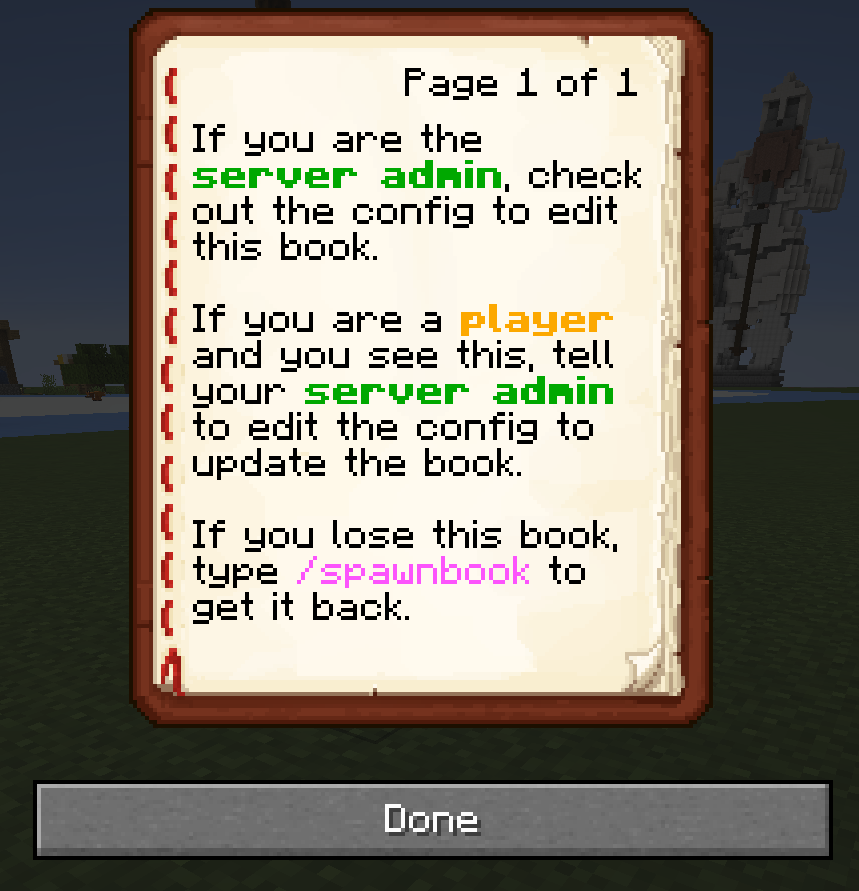

# Spawnbook

Spawnbook is a configurable serverside mod for Fabric. It lets you create a book from a config file, that players will recieve the first time they log in to your server. You can use it to introduce players to your server, tell them some rules, or whatever you want.

## Setup

Simply place the jar into your server's mod folder and start up your server. Players will recieve the default book upon login until you edit the config. It is recommended that you edit the config before allowing other players online.

## Config

You can edit the config, and save it live. The next spawnbook will have the updated values as soon as the config is changed. You do not need to enter a reload command or restart the server. Simply use `/spawnbook` to get another spawnbook to check out the changes you made to the config.

Below is the default `spawnbook.json` file.

```json5
{
  "Pages": [
    [
      {
        "text": "If you are the ",
        "color": "reset",
      },
      {
        "text": "server admin",
        "color": "dark_green",
        "bold": true,
      },
      {
        "text": ", check out the",
        "color": "reset",
      },
      {
        "text": " config to edit this book.\n\nIf you are a ",
        "color": "reset",
      },
      {
        "text": "player",
        "color": "gold",
        "bold": true,
      },
      {
        "text": " and you see this, tell your ",
        "color": "reset",
      },
      {
        "text": "server admin",
        "color": "dark_green",
        "bold": true,
      },
      {
        "text": " to edit the config to update the book.\n\nIf you lose this book, type ",
        "color": "reset",
      },
      {
        "text": "/spawnbook",
        "color": "light_purple",
      },
      {
        "text": " to get it back.",
        "color": "reset",
      },
    ],
  ],
  "Author": "Server Admin",
  "Title": "Spawnbook",
  "IsDefaultSettings": false, // change this to true to reset to default settings on next reload
}
```

The above config generates the book below.

<h1 id="book"align="center">
  
</h1>

This is a `spawnbook.json` config illustrating multiple pages.

```json5
{
  "Pages": [
    [  // Page one
      {
        "text": "This is page one.\n",
        "color": "reset"
      },
      {
        "text": "Here is more page 1 text.",
        "color": "aqua"
      }
    ], // End of page one
    [  //Page two
      {
        "text": "This is page two.",
        "color": "gray"
      }
    ] // End of page two
  ],
  "Author": "Server Admin",
  "Title": "Spawnbook with 2 Pages",
  "IsDefaultSettings": false
}
```

## Command
Anyone can use `/spawnbook` to get the spawnbook back. This is also useful for testing the config.